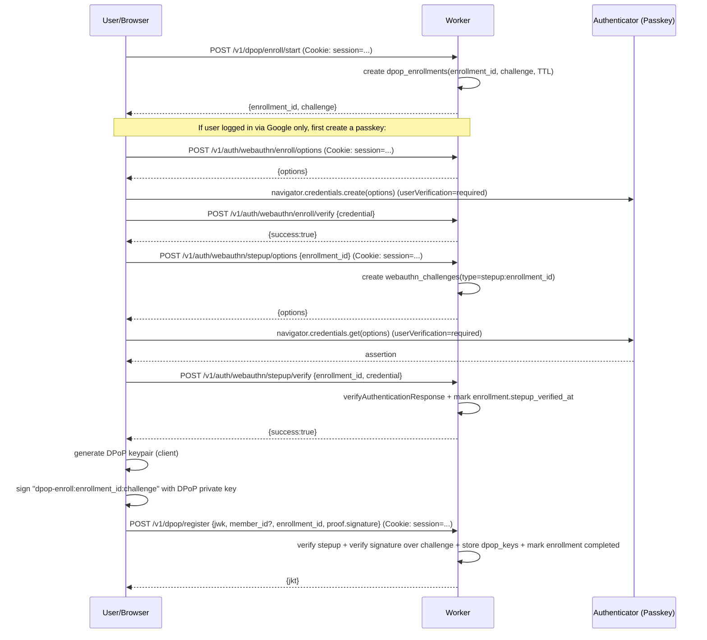

# DPoP-based Login Site + Event Ingest + FDS Engine

[](https://www.youtube.com/watch?v=r-Hb6Cjfe4c)

This project implements a DPoP-based authentication system with event ingestion and a Fraud Detection System (FDS) engine using Cloudflare Workers and D1.

## Features

- **Login Site**: Web-based login at `https://login.access.example.com` supporting Passkey (WebAuthn) and Google OIDC.
- **DPoP Registration**: After login, register a DPoP public key bound to the user.
- **Event Ingestion**: Ingest events with DPoP proof verification.
- **FDS Engine**: Analyze events for fraud using various rules.

## Setup

1. Install dependencies: `npm install`
2. Create local dev vars: `cp .dev.vars.example .dev.vars` and fill in values (see below)
3. Configure `wrangler.toml` with your D1 database ID (do not commit secrets here).
3. Initialize D1 schema:
   - Remote: `wrangler d1 execute dpop_db --file=./schemas/init.sql`
   - Local: `wrangler d1 execute dpop_db --local --file=./schemas/init.sql`
4. Run locally: `npm run dev -- --local`
5. Deploy: `npm run deploy`

### Local multi-domain (hosts) setup (optional)

If you want to simulate separate legacy sites and a dedicated DPoP/login site locally (e.g. `www.okcashbag.com` + `login.okcashbag.com`),
you can map local dev hostnames to `127.0.0.1` and use a local TLS proxy.

1) Add to your hosts file (examples):

```text
127.0.0.1 login.okcashbag.local
127.0.0.1 www.okcashbag.local
127.0.0.1 m.okcashbag.local
127.0.0.1 webview.okcashbag.local
```

Optional: if you want the **DPoP site origin** to look like production, you can also map:

```text
127.0.0.1 dpop.skplanet.com
```

Alternative (no hosts-file edits): launch Chromium with host mapping rules:

```bash
# macOS example (Chrome). Do NOT add --ignore-certificate-errors if you want WebAuthn/Passkey to work.
open -na "Google Chrome" --args \
  --user-data-dir="$PWD/.chrome-profile" \
  --host-resolver-rules="MAP dpop.skplanet.com 127.0.0.1, MAP www.okcashbag.com 127.0.0.1, MAP member.okcashbag.com 127.0.0.1"
```

2) Generate local certificates (creates a local CA + SAN cert):

```bash
bash dev/generate-local-certs.sh
```

3) Trust the local CA cert in your OS/browser:

- macOS: Keychain Access → import `dev/certs/local-ca.crt` → set to “Always Trust”
- macOS (recommended, one command): `bash dev/trust-local-ca-macos.sh` (requires sudo)

4) Run the worker + TLS proxy:

```bash
npm run dev -- --local
npm run dev:tls
```

Then open:

- `https://login.okcashbag.local:8443/`
- (optional) `https://dpop.skplanet.com:8443/`

Note: WebAuthn requires HTTPS (or `localhost`). The TLS proxy exists only for local multi-domain testing.

If you see `NotAllowedError: WebAuthn is not supported on sites with TLS certificate errors`, it means the browser considers the cert **invalid/untrusted**. Fix by:

- Trusting the local CA (`dev/certs/local-ca.crt`) in your OS trust store (not just “proceed anyway” in the browser)
- Restarting Chrome/Chromium
- Do **not** use `--ignore-certificate-errors` for Passkey/WebAuthn testing (WebAuthn will be blocked)

### Local WebAuthn note

WebAuthn requires a secure context. `localhost` is treated as secure, so for local dev set:

- `RP_ID = "localhost"`
- `ORIGIN = "http://localhost:8787"`

in `wrangler.toml` (or your dev-only overrides).

If you use the TLS proxy + `dpop.skplanet.com`, set in `.dev.vars`:

- `RP_ID=dpop.skplanet.com`
- `ORIGIN=https://dpop.skplanet.com:8443`

### Google OAuth secrets

Do not commit `GOOGLE_CLIENT_SECRET` to `wrangler.toml`. Use either:

- Wrangler secret: `npx wrangler secret put GOOGLE_CLIENT_SECRET`
- Local dev vars file: create `.dev.vars` (see `.dev.vars.example`)

#### Google Cloud Console (required to get client_id/secret)

You must create a Google OAuth 2.0 / OIDC client to obtain:

- `GOOGLE_CLIENT_ID`
- `GOOGLE_CLIENT_SECRET`

In Google Cloud Console → **APIs & Services** → **Credentials** → **Create Credentials** → **OAuth client ID** (Web application),
add this redirect URI for local dev:

- `http://localhost:8787/v1/auth/google/callback`

### Access token signing secret (B plan)

This project issues short-lived access tokens for ingestion, and requires **both**:

- `Authorization: DPoP <access_token>`
- `DPoP: <proof>`

Set `ACCESS_TOKEN_SECRET` (dev-only) in `.dev.vars`, and store it as a Worker secret in production.

## API Endpoints

- `POST /v1/auth/webauthn/options`: Get WebAuthn options
- `POST /v1/auth/webauthn/verify`: Verify WebAuthn credential
- `POST /v1/auth/webauthn/enroll/options`: Create a passkey for the current session user (Google-only accounts)
- `POST /v1/auth/webauthn/enroll/verify`: Verify passkey enrollment and store credential
- `GET /v1/auth/google/start`: Start Google OAuth
- `GET /v1/auth/google/callback`: Handle Google OAuth callback
- `POST /v1/dpop/register`: Register DPoP key (requires session)
- `POST /v1/dpop/enroll/start`: Start DPoP enrollment (requires session)
- `POST /v1/auth/webauthn/stepup/options`: Get step-up assertion options (requires session + existing passkey)
- `POST /v1/auth/webauthn/stepup/verify`: Verify step-up assertion (requires session)
- `POST /v1/ingest/event`: Ingest event (requires `Authorization: DPoP <token>` and `DPoP` proof)
- `GET /v1/export/canonical`: Export canonical events

## DPoP Verification (what is checked)

The `DPoP` header is expected to be a compact JWT with `typ=dpop+jwt`.

Verification checks:

- `htm` matches the HTTP method
- `htu` matches the request URL (**canonicalized**; see below)
- `iat` is within a time window
- `jti` uniqueness with TTL 120s (replay protection)
- JWT signature validity
- key must already be registered (JWK thumbprint = `jkt` exists in `dpop_keys`)

### DPoP htu canonicalization (important)

To avoid common real-world mismatches, the server compares `htu` using a canonical form:

- **Compare**: `origin + pathname` only (query/fragment ignored)
- **Normalize**: lowercase host, ignore default port (`:80` for http, `:443` for https)
- **Normalize**: trim trailing slash (except `/`)

Recommendation: clients should build `htu` as `window.location.origin + pathname` (no query).

### DPoP header size (jwk vs kid)

This Worker supports both:

- **Simple mode (demo)**: DPoP JWT header includes `jwk` each request (bigger header)
- **Production-friendly mode**: DPoP JWT header includes `kid` (treated as `jkt`) and the server loads the registered public JWK from `dpop_keys`

## Flows (Mermaid)

### Google login (OIDC code flow + PKCE)


### Google OIDC verification checklist (implemented)

- **id_token verification**: `iss` / `aud` / `exp` (and `iat` sanity window) + `nonce`
- **state**: one-time (deleted on first use) + TTL enforced
- **redirect_uri**: fixed to `ORIGIN + /v1/auth/google/callback` (not derived from request URL)
- **email usage**: if we use email for account linking, we require `email_verified === true`
- **final identity**: account identity is determined by **`id_token.sub`** (userinfo is not used as the source of truth)

### Passkey login/registration (WebAuthn)


### DPoP key enrollment (step-up gated)



### Event ingest (DPoP proof required)


## Testing

Run tests: `npm test`

## Legacy integration (popup SDK, remote signing model)

This repo now supports a **remote signing** integration:

- legacy sites load `GET /sdk.js`
- the SDK opens a popup at `GET /sdk/agent`
- the popup (dedicated DPoP site origin) holds the DPoP private key and sends `POST /v1/ingest/event` directly
- the legacy site only sends event payloads to the popup via `postMessage`

Security controls:

- the popup only accepts `postMessage` from origins in `SDK_ALLOWED_ORIGINS` (exact `origin` match, comma-separated)
- you can additionally pin `client_origin` via `/sdk/agent?client_origin=...` (the SDK does this automatically)

## Local ingest demo (DPoP proof)

1. Open `http://localhost:8787/`, login, then click **Generate & Register DPoP Key**
2. The `/v1/dpop/register` response includes a short-lived `access_token` (token_type `DPoP`). For convenience, the demo page also stores it in:

```js
localStorage.getItem('access_token')
```

3. Run the demo sender (set both ACCESS_TOKEN and DPOP_PRIVATE_JWK):

```bash
ACCESS_TOKEN='eyJ...' DPOP_PRIVATE_JWK='{"kty":"EC",...}' node scripts/ingest-demo.mjs http://localhost:8787 1234567
```

Alternatively, you can add the key to `.dev.vars`:

```text
DPOP_PRIVATE_JWK={"kty":"EC",...}
```

And you may also temporarily add the access token to `.dev.vars` for the node script:

```text
ACCESS_TOKEN=eyJ...
```

## Attack demos (showing failures) — 3 scenarios

The ingestion endpoint enforces **B plan**:

- client must send both `Authorization: DPoP <access_token>` and `DPoP: <proof>`
- the server enforces **token↔proof binding**: `token.cnf.jkt === proof.jkt`
- the proof key must be **registered** in `dpop_keys`

### Scenario 1 (A): Stolen access_token alone is useless

**Attacker capability**: steals `access_token` only (no private key).  
**What they try**: call ingest with `Authorization: DPoP <token>` but without `DPoP` header.  
**Expected**: server returns `reason_codes` containing **`PROOF_MISSING`**.

How to reproduce quickly:

- in the demo UI, load a token in the attacker panel and click **Attack A: token only (no DPoP)**.

### Scenario 2 (B): Stolen token + attacker key proof fails (unregistered key)

**Attacker capability**: steals `access_token` (bound to a registered key), but does not have the matching registered private key.  
**What they try**: generate their own (unregistered) key and send a valid DPoP proof for it with the stolen token.  
**Expected**: server rejects with `reason_codes` containing **`UNREGISTERED_KEY`** (and `PROOF_INVALID` wrapper).

How to reproduce in the demo UI:

1. In the attacker panel click **Load current token**
2. Click **Generate unregistered attacker key**
3. Click **Send token + proof**

### Scenario 3 (C): Attacker has server token signing secret but no registered key

**Attacker capability**: has `ACCESS_TOKEN_SECRET` so they can forge access tokens.  
**What they try**: forge a token bound to an attacker key (their own), then send a valid proof for that key.  
**Expected**: server still rejects because the key isn’t registered: `reason_codes` contains **`UNREGISTERED_KEY`**.

This is implemented in the demo UI (test only), and also as a node script:

- Demo UI: use the attacker panel section "Scenario C (test only)" and click the button.

```bash
node scripts/attack-forged-token-unregistered-key.mjs http://localhost:8787 1234567
```

## Schemas

See `schemas/init.sql` for D1 table definitions.